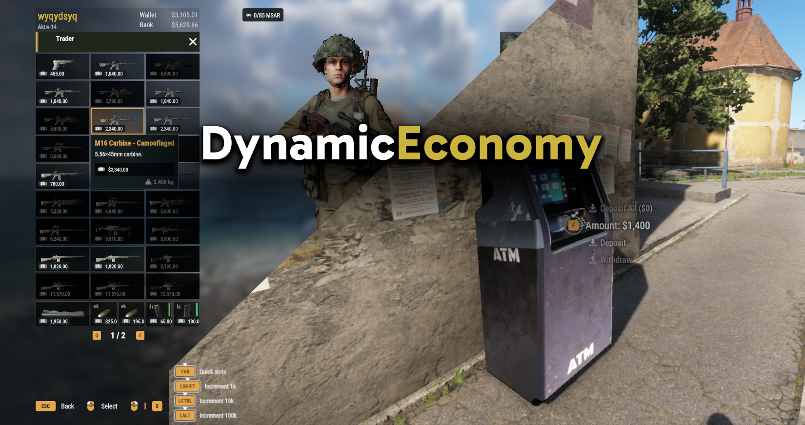

# DynamicEconomy

## About
Arma Reforger Conflict-compatible dynamic economy system with cash, banking/ATMs and traders/shops.

Originally created to implement banking and traders in my FFA PvPvE game mode [MercOut!](https://reforger.armaplatform.com/workshop/64C4F3E0169E5739-MercOut), released stand-alone for others to use in their own game modes or servers 🙂

## Setup
See included `Arland_Test.ent` world or contents of `Prefabs/DE_Examples` for examples.

## Systems
 - Needs a Systems Config with `DL_LootSystem` and `DE_EconomySystem` enabled e.g. `ConflictSystems.conf` or add them to your own config.
 - Configure global settings like default trader margins, cash:supply exchange rate etc on `DE_EconomySystem`

## Traders
 - Add `DE_TraderComponent` to your trader entity (probably a character, make sure to disable their damage manager if you don't want them to be killable!)
 - Configure any settings on the component as needed. By default traders can sell every item in EntityCatalogs of all factions in the world's FactionManager which can be filtered based on regular Arsenal filters or a prefab whitelist for unique traders.

## Banking
 - For ATMs, simply add `DE_ATM.et` prefabs to your world / buildings
 - For Banker characters, add `DE_BankComponent` to desired banker character prefab

## Credits
 - Cash stack model: Sebastian Webster - https://sketchfab.com/3d-models/australian-20-bills-d0e6db1b7cca4c89976d118c9b88fab7
 - ATM model: Mehdi Shahsavan - https://sketchfab.com/3d-models/atm-12-mb-11d95f8395e4422b8aa29ea7044d2810

## License
APL - https://www.bohemia.net/community/licenses/arma-public-license